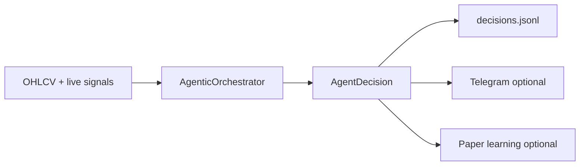

# Agentic Advisory Workflow

Fortuna's advisory layer combines deterministic strategy signals, optional ML and RL
evidence, portfolio context, and risk review into a single auditable `AgentDecision`
per symbol. The system is **advisory-first**: it recommends actions; it does not
place live broker orders unless execution is explicitly enabled (paper broker only
by default).

## Data flow

### Agents (all optional / fail-soft)

| Agent | Role |
|---|---|
| `MarketContextAgent` | Session/regime summary |
| `DeterministicSignalAgent` | Strategy signal votes |
| `MLSignalScorerAgent` | Signal-quality score (when ML artifact loaded) |
| `RLPolicyAgent` | RL action vote (when checkpoint loaded) |
| `PortfolioContextAgent` | Current position / holding state |
| `RiskReviewAgent` | Blocks or downgrades weak entries |
| `DecisionSynthesizer` | Final action + confidence + rationale |
| `NotificationComposer` | Telegram-ready message from final decision only |

Primary API: `AgenticOrchestrator.decide(context)` → `AgentDecision`.

## Runtime wiring

[`FortunaSessionEngine`](../src/fortuna/app/session_engine.py) builds the orchestrator
when `FORTUNA_AGENTIC_ENABLED=1`. On each live bar close it:

1. Computes deterministic (+ optional RL) live signals.
2. Runs `decide()` and appends to `logs/agentic/decisions.jsonl`.
3. Optionally sends Telegram via `NotificationDispatcher` (dedupe + throttle + audit).
4. Optionally records paper-learning rows when paper learning is enabled.

Multi-symbol prefetch uses `notify=False` so Streamlit refresh does not spam alerts.

## Settings

| Setting | Env | Default | Effect |
|---|---|---|---|
| `agentic_enabled` | `FORTUNA_AGENTIC_ENABLED` | `false` | Master switch |
| `agentic_paper_learning_enabled` | `FORTUNA_AGENTIC_PAPER_LEARNING_ENABLED` | `false` | Paper router + learning rows |
| `agentic_ml_scorer_enabled` | `FORTUNA_AGENTIC_ML_SCORER_ENABLED` | `false` | Load ML scorer into orchestrator |
| `agentic_log_dir` | `FORTUNA_AGENTIC_LOG_DIR` | `logs/agentic` | Decision + notification logs |
| `telegram_enabled` | `FORTUNA_TELEGRAM_ENABLED` | `false` | Telegram bot sender |
| `telegram_max_per_symbol_per_session` | `FORTUNA_TELEGRAM_MAX_PER_SYMBOL_PER_SESSION` | `10` | Throttle cap |
| `telegram_min_interval_seconds` | `FORTUNA_TELEGRAM_MIN_INTERVAL_SECONDS` | `300` | Min gap between sends per symbol |
| `telegram_quiet_hours_enabled` | `FORTUNA_TELEGRAM_QUIET_HOURS_ENABLED` | `true` | Block outside NSE 09:15–15:30 IST |
| `model_registry_enabled` | `FORTUNA_MODEL_REGISTRY_ENABLED` | `false` | Load only promoted ML/RL artifacts |

See also [ML signal scorer](ml_signal_scorer.md), [RL policy workflow](rl_policy_workflow.md),
and [operator runbook](operator_runbook.md).

## Deterministic fallback

If agentic, ML, RL, or Telegram code fails or is disabled:

- Dashboard deterministic signals and backtests continue unchanged.
- Missing ML/RL artifacts produce neutral agent votes, not errors.
- Telegram disabled → zero network calls; `_notification_dispatcher` is `None`.

## Failure modes

| Symptom | Likely cause | Mitigation |
|---|---|---|
| No agent decisions | `agentic_enabled=false` | Set `FORTUNA_AGENTIC_ENABLED=1` |
| ML votes missing | Scorer not loaded / not promoted | See [ml_signal_scorer.md](ml_signal_scorer.md) |
| RL votes missing | No per-symbol checkpoint | See [rl_policy_workflow.md](rl_policy_workflow.md) |
| Telegram not sent | Disabled, throttled, deduped, or quiet hours | Check `logs/agentic/notifications.jsonl` |
| Duplicate alerts on refresh | Should not happen | Prefetch uses `notify=False`; restart dedupe reloads previously sent or already-deduped keys from audit |

## Logs

| File | Contents |
|---|---|
| `logs/agentic/decisions.jsonl` | Final decisions (votes, rationale, optional notification intent) |
| `logs/agentic/notifications.jsonl` | Send attempts: sent, deduped, throttled, errors |
| `logs/agentic/learning_rows.jsonl` | Paper-learning outcomes (when enabled) |

## Related docs

- [ML signal scorer](ml_signal_scorer.md)
- [RL policy workflow](rl_policy_workflow.md)
- [Operator runbook](operator_runbook.md)
