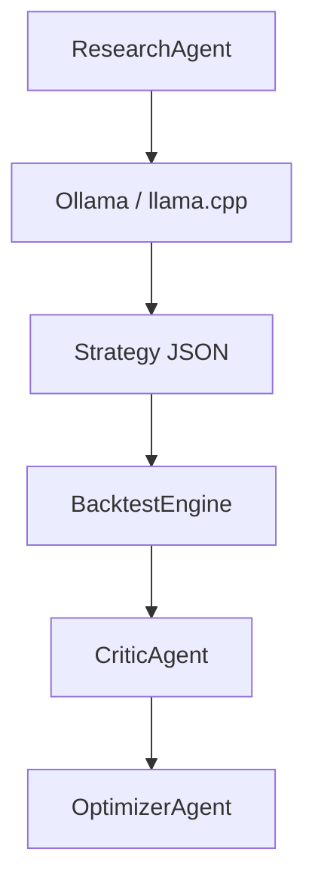

# Agent Architecture (Phase 1 Stubs)

Phase 1 defines **interfaces only**. No Ollama, llama.cpp, or LangGraph runtime is bundled.

## Interfaces

| Agent | Method | Purpose |
|-------|--------|---------|
| `ResearchAgent` | `propose_strategy(context)` | Generate strategy JSON |
| `CriticAgent` | `critique(strategy, metrics)` | Review backtest quality |
| `OptimizerAgent` | `suggest_params(strategy, history)` | Tune parameters |

## Stubs

- `NullResearchAgent` — loads a default JSON strategy file
- `RuleBasedCriticAgent` — threshold checks on Sharpe, drawdown, trades
- `PassThroughOptimizerAgent` — returns strategy unchanged

## Future integration (Phase 2+)

### Ollama

Subclass `ResearchAgent`, call local API, parse JSON into `StrategyDefinition.model_validate()`.

### LangGraph

Model nodes: `research` → `backtest` → `critic` → `optimizer` with conditional edges on `CritiqueResult.approved`.

### Design rule

**LLMs propose strategies; they do not execute trades directly.**
