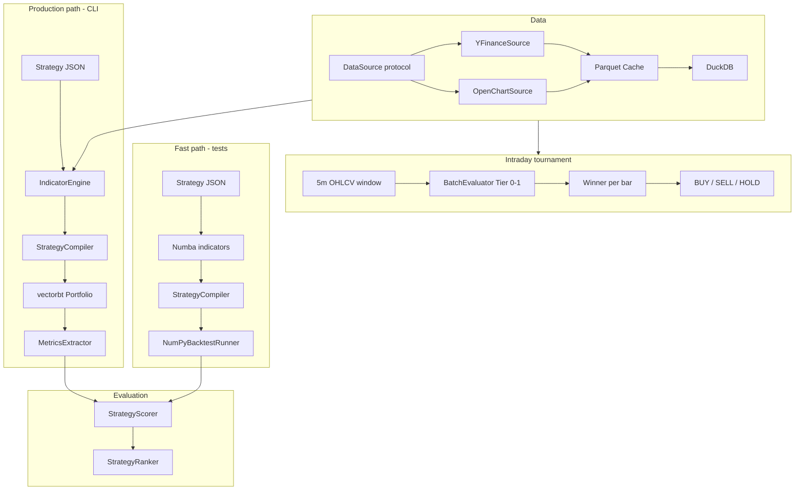

# Fortuna Architecture (Phase 1)

## Overview

Fortuna Phase 1 is a **deterministic research pipeline**. Data flows through ingestion, indicator computation, signal compilation, backtest simulation, and composite scoring. LLM agents are interface-only stubs.

## Module boundaries

| Module | Responsibility |
|--------|----------------|
| `fortuna.config` | YAML + env settings |
| `fortuna.strategy` | Pydantic DSL, JSON load/save |
| `fortuna.data` | Pluggable sources (yfinance, OpenChart), cache, DuckDB |
| `fortuna.search` | Param grids, indicator cache, batch evaluation |
| `fortuna.tournament` | Per-bar winner selection and signal logging |
| `fortuna.arena` | Multi-strategy competition + per-strategy param search |
| `fortuna.reporting` | TradingView-style Profit % / Win Ratio reports |
| `fortuna.data.stream` | Rolling OHLCV windows from DuckDB/Parquet |
| `fortuna.paper` | Walk-forward paper league + adaptive param learning |
| `fortuna.quant` | Optional BS theoretical benchmark (not for signals) |
| `fortuna.compute` | GPU/CPU scheduler, VRAM-aware indicator batching |
| `fortuna.indicators` | Numba kernels + pandas for MACD/Bollinger |
| `fortuna.backtesting` | Compile signals; vectorbt or NumPy runner |
| `fortuna.evaluation` | Score, rank, persist strategies |
| `fortuna.agents` | ABC interfaces + deterministic stubs |
| `fortuna.ports` | Protocol interfaces for swapping implementations |

## Backtest runners

| Runner | Use case | Dependencies |
|--------|----------|--------------|
| `NumPyBacktestRunner` | Fast unit tests, long-only percent SL/TP | NumPy only |
| `BacktestEngine` | Production CLI, full vectorbt features | vectorbt (lazy import) |

## Strategy DSL

Strategies are declarative JSON files:

- **Indicators** — named series attached to OHLCV
- **Rules** — recursive conditions (`compare`, `crossover`, `and`, …)
- **Risk** — percent stop loss, take profit, position sizing

The `StrategyCompiler` evaluates conditions bar-by-bar into boolean entry/exit series.

## Storage conventions

| Folder | Contents |
|--------|----------|
| `data/market_cache/{SYMBOL}/{timeframe}.parquet` | OHLCV cache |
| `strategies/generated/` | Input strategies |
| `strategies/validated/` | Passed scoring threshold |
| `strategies/rejected/` | Failed scoring threshold |

Each persisted strategy includes a `.score.json` sidecar with metrics.

## Testing

- Default: `pytest` runs fast tests (`-m 'not slow'`)
- Slow integration: `pytest -m slow` loads vectorbt once

## Future phases (not implemented)

- Walk-forward validation (`StubWalkForwardValidator`)
- LLM research via Ollama / LangGraph
- Regime detection agent
- Paper trading and broker execution

## Hardware notes

On 8GB RAM systems:

- Backtest **one symbol** per run
- Prefer daily timeframes for development
- Use Parquet cache to avoid repeated downloads
- Run `pytest` without `-m slow` during development
